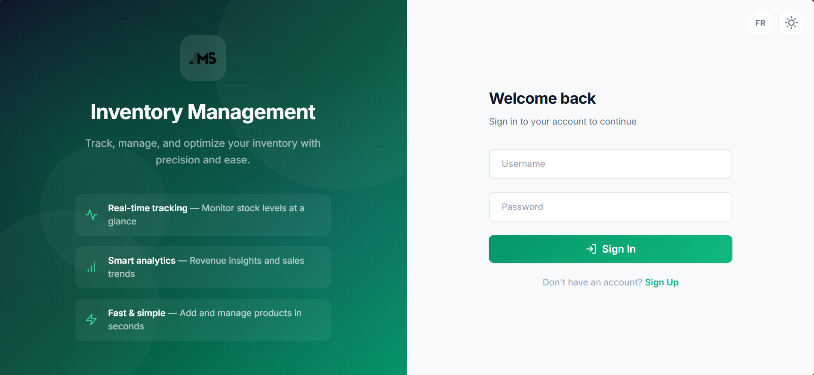
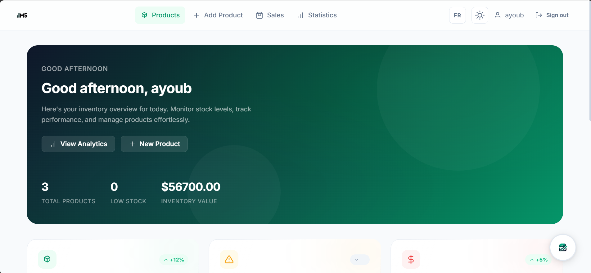
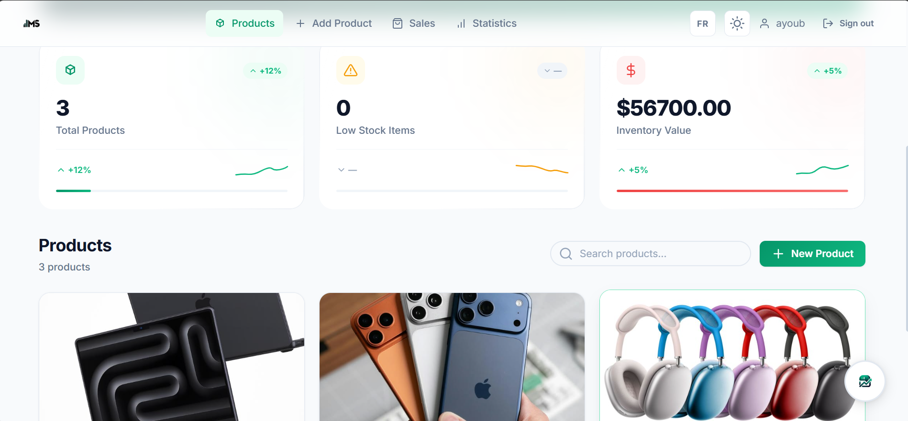
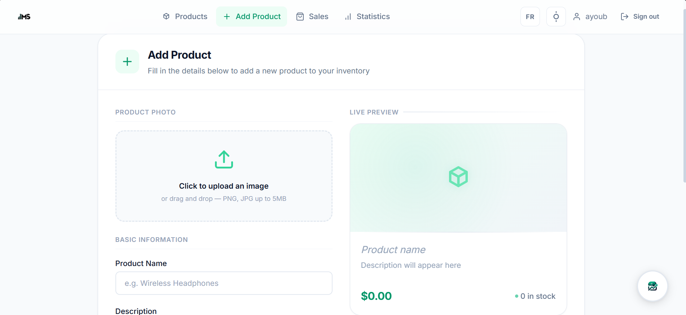
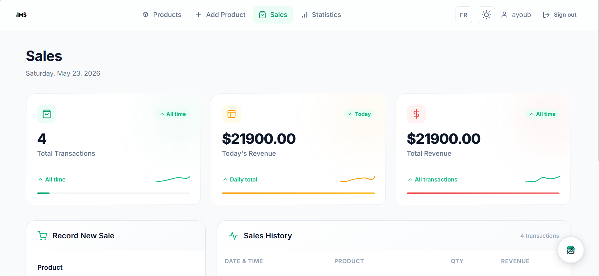
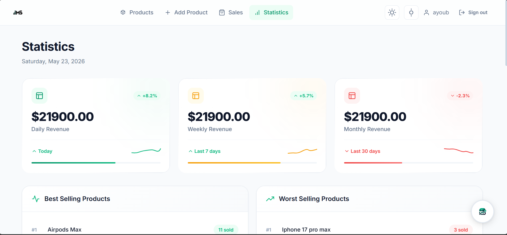
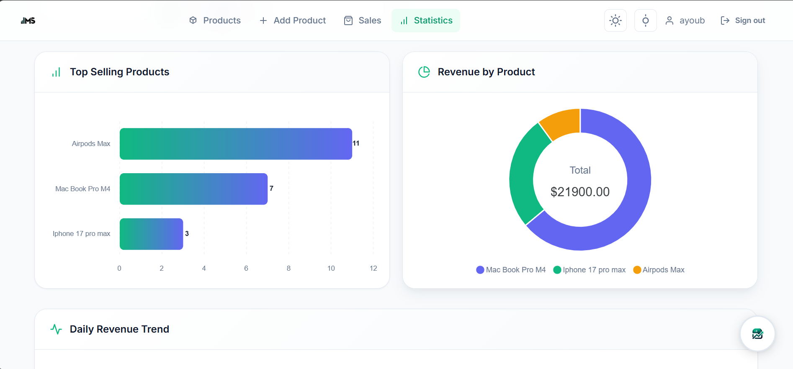
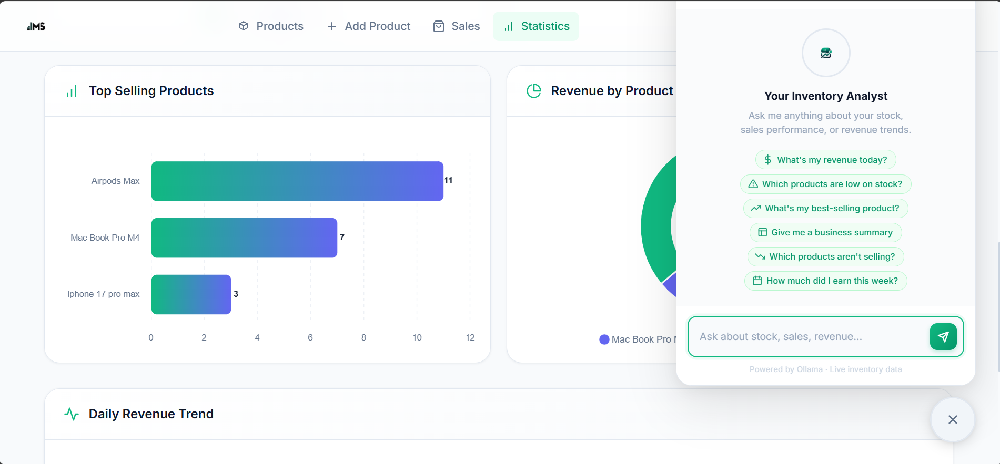
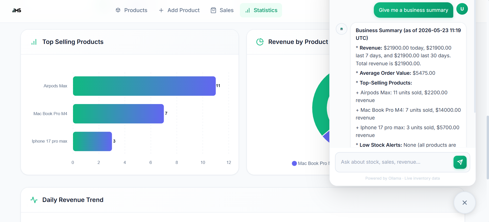

<div align="center">


# Inventory Management System

A modern, full-stack inventory management application with AI-powered analytics.

[](https://inventory-management-system-production-3b31.up.railway.app/app/login.html)
[](https://hub.docker.com/r/ayoubzaro/inventory-management-system)
[](https://github.com/AyOuBzArO/Inventory-management-system)


</div>

---

## Demo Video


---

## Screenshots

### Login


### Dashboard


### Products


### Add Product — Live Preview


### Sales


### Statistics


### Charts


### AI Assistant — Suggestions


### AI Assistant — Business Summary


---

## Features

**Dashboard** — Personalized greeting, real-time KPI cards (total products, low-stock count, inventory value), sparkline charts, and quick-action shortcuts.

**Product Management** — Full CRUD with drag-and-drop image upload, live preview card while typing, and instant stock updates.

**Sales Tracking** — Record sales, track total transactions, today's revenue, and all-time revenue. Full history table with date, product, quantity, and revenue.

**Statistics & Charts** — Daily / weekly / monthly revenue with trend indicators. Best and worst seller rankings. Bar chart, donut chart, and daily revenue trend line — all interactive via ApexCharts.

**AI Analytics Assistant** — A chat assistant embedded on every authenticated page. Reads live database context on every message and answers questions like *"What's my best-selling product?"* or *"Give me a business summary."* Runs on Ollama locally (free, offline) and automatically falls back to Groq cloud when deployed. Includes suggestion chips, conversation history, typing indicator, and markdown rendering.

**Bilingual Interface** — Full English / French toggle on every page, persisted in `localStorage`. All labels, buttons, table headers, and dynamic strings are translated.

**Theme** — Light and dark mode, persisted across sessions.

**Authentication** — JWT-based auth with 60-minute token expiry. Passwords hashed with bcrypt. All API routes are protected.

**Persistent Database** — PostgreSQL in production (Railway), SQLite in development. Data survives restarts and redeploys.

**Docker** — Single command to run anywhere. Image published to Docker Hub.

---

## Tech Stack

| Layer | Technology |
|---|---|
| Backend | FastAPI · Python 3.13 · Uvicorn |
| Database | SQLAlchemy ORM · PostgreSQL (prod) · SQLite (dev) |
| Auth | JWT (python-jose) · bcrypt |
| AI — Local | Ollama · qwen2.5:7b |
| AI — Cloud | Groq API · llama-3.1-8b-instant (free tier) |
| Frontend | Vanilla HTML5 · CSS3 · JavaScript |
| Charts | ApexCharts |
| i18n | Custom EN/FR engine · localStorage |
| Deployment | Railway · Docker · Docker Hub |

---

## Getting Started

### Prerequisites
- Python 3.10+
- [Ollama](https://ollama.com) *(optional — only for local AI)*

### Run Locally

```bash
git clone https://github.com/AyOuBzArO/Inventory-management-system.git
cd Inventory-management-system

python -m venv venv
venv\Scripts\activate        # Windows
source venv/bin/activate     # macOS / Linux

pip install -r requirements.txt
uvicorn backend.main:app --reload --port 8080
```

Open `http://localhost:8080`

### Enable AI (local)

```bash
ollama pull qwen2.5:7b
ollama serve
```

### Run with Docker

```bash
docker pull ayoubzaro/inventory-management-system:latest
docker run -p 8080:8080 ayoubzaro/inventory-management-system:latest
```

---

## Deploy on Railway

1. Fork this repository
2. Create a new Railway project → **Deploy from GitHub repo**
3. Add a **PostgreSQL** database service — Railway auto-injects `DATABASE_URL`
4. Set these environment variables on your app service:

| Variable | Description |
|---|---|
| `SECRET_KEY` | Any long random string — signs JWT tokens |
| `GROQ_API_KEY` | Free key from [console.groq.com](https://console.groq.com) — enables AI in the cloud |

Railway redeploys automatically on every `git push`.

---

## Project Structure

```
Inventory-management-system/
├── backend/
│   ├── models/           # User, Product, Sale — SQLAlchemy models
│   ├── routes/           # auth, products, sales, chat — API routers
│   ├── schemas/          # Pydantic request / response schemas
│   ├── auth.py           # JWT + bcrypt helpers
│   ├── config.py         # Environment variables
│   ├── database.py       # Engine, session, Base
│   └── main.py           # App entry point
├── frontend/
│   ├── css/style.css
│   ├── js/
│   │   ├── app.js        # Theme, i18n engine, shared utilities
│   │   └── chat.js       # AI chat widget (self-contained)
│   ├── index.html        # Dashboard
│   ├── sales.html
│   ├── statistics.html
│   ├── add-product.html
│   ├── login.html
│   ├── logo.png
│   └── ai-avatar.png
├── docs/screenshots/
├── Dockerfile
├── requirements.txt
└── README.md
```

---

## Security

| Concern | Implementation |
|---|---|
| Passwords | bcrypt hash — plain text never stored |
| Session tokens | JWT signed with `SECRET_KEY`, 60 min expiry |
| API protection | Every route requires `Authorization: Bearer <token>` |
| Database | PostgreSQL on Railway's private network |
| Secrets | All keys via environment variables, never in source code |

> Always set a strong, unique `SECRET_KEY` in production. The default value is insecure.

---

## License

MIT © [Ayoub Zarkouni](https://github.com/AyOuBzArO)
